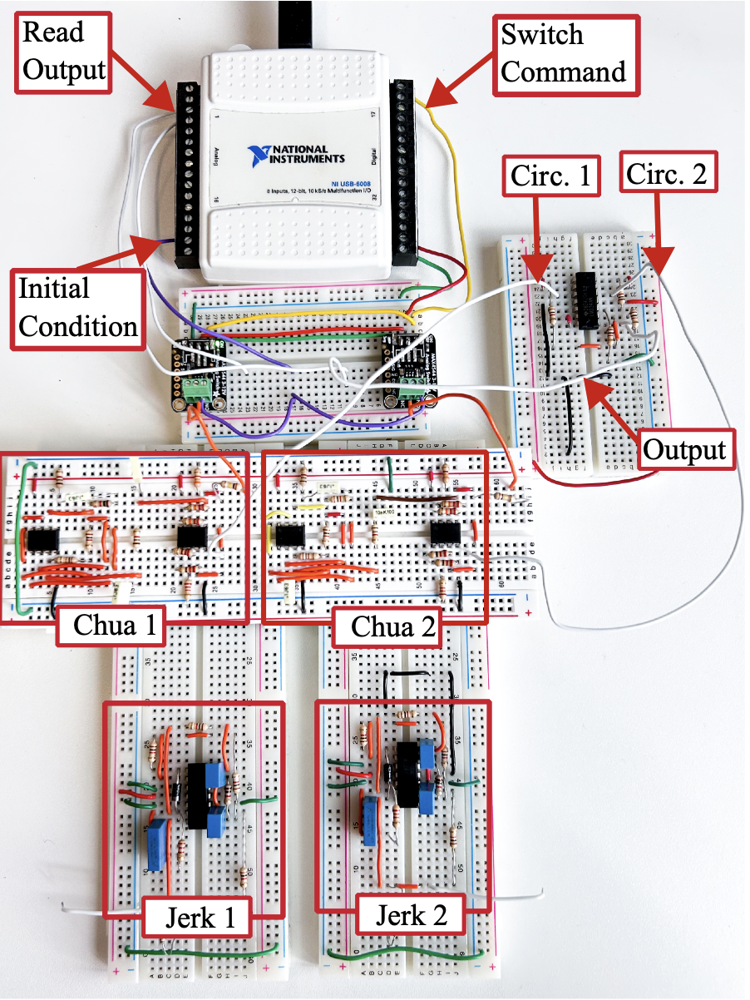
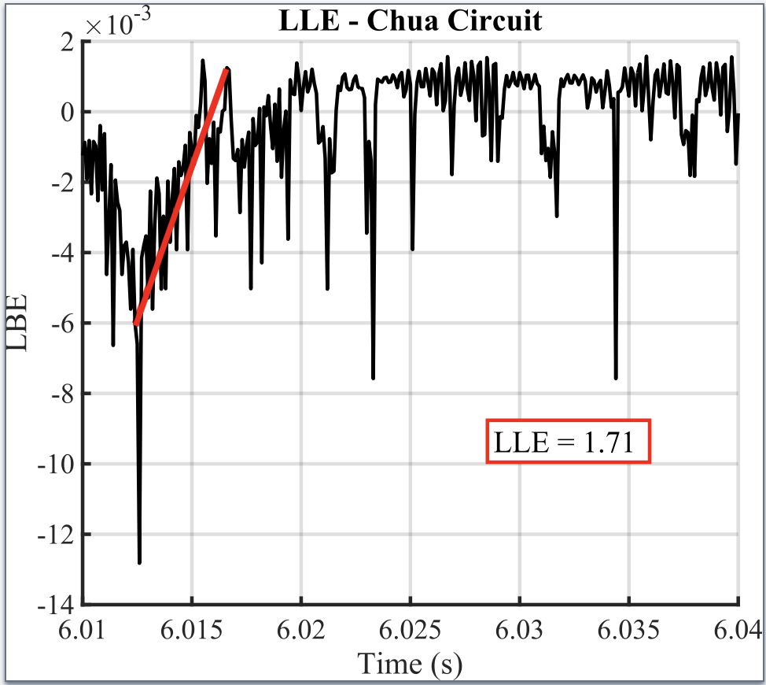
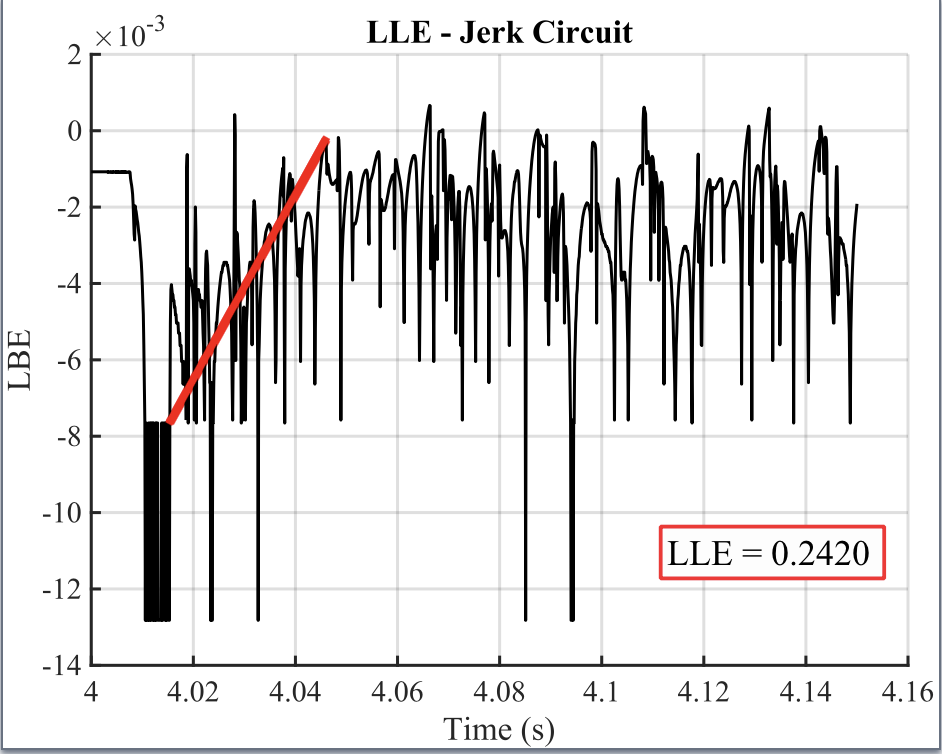

# Switch-Controlled Initial Conditions in Chaotic Circuit Assemblies

  

This repository contains the datasets used and collected for the article *Switch-Controlled Initial Conditions in Chaotic Circuit Assemblies for Largest Lyapunov Exponent Estimation*, submitted to **ISCAS 2026**.  

If any data from this repository is used, due credit must be given by citing the article.  
Nazaré, T., & Nepomuceno, E. (2025). Switch-Controlled Initial Conditions in Chaotic Circuit Assemblies for Largest Lyapunov Exponent Estimation [Data set]. OSF. https://doi.org/10.17605/OSF.IO/QGCDU

---

## Authors

**Thalita Nazaré**a  
*thalita.nazare.2023@mumail.ie*  
**Erivelton Nepomuceno**a  

a Hamilton Institute  
Centre for Ocean Energy Research  
Department of Electronic Engineering  
Maynooth University, Ireland  

---

## Repository Structure

### `Wolf-Data/`  
This folder contains the datasets used to estimate the Lyapunov exponent using the **Wolf method** (e.g., `autocorr.dat`, `fnn.dat`, `lyapmax.dat`, etc.), for both the jerk and Chua circuits. Each circuit has a dedicated subfolder.  

### `Experimental Data/`  
This folder contains the experimental voltage data collected from each circuit.  
- Files containing `2Circ` correspond to voltages acquired directly at the output of each individual circuit.  
- Files containing `LLE` correspond to the output of the hardware subtractor, used for Lyapunov exponent estimation.  

---

## Results from the Article

As explained in the manuscript, the following figures illustrate the results of the experimental estimation of the Largest Lyapunov Exponent (LLE) obtained from the collected data.

  
  

